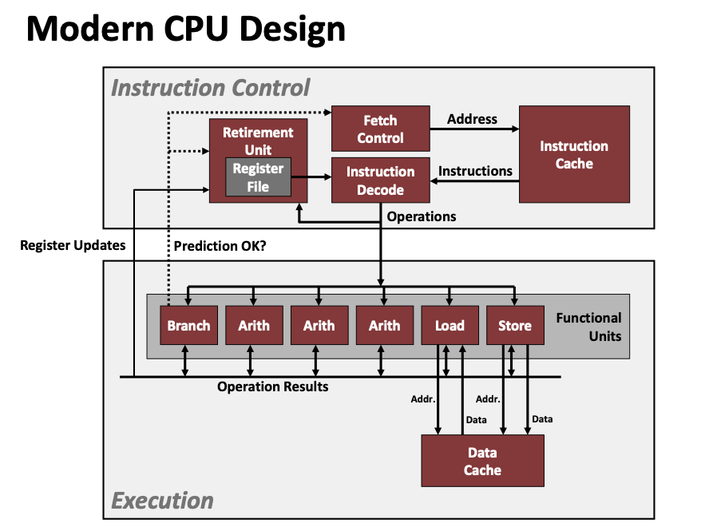

Questions:

1. How to code optimization is estabilished in the bubble sort example?´
2. 

# Overview

## Performance Realities

There is more to performance than asymptotic complexity, and constant factors matter too!
In general, code optimization consists of four stages: algorithm, data representations, procedures, and loops.

**Important:**: We need to understand system to optimize performance. It consists of following questions:

* How programs are compiled and excuetd?
* How modern processrs + memory systems operate?
* How to measure program performance and identify bottlenecks?
* How to improve performance without destroying code modularity and generality?

# Useful Optimizations

## Code Motion

Reduce frequence with which computation performed， If it will always produce same result

```C
void set_row(double *a, double *b, long i, long n)
{
    //original version
    long j;
    for(j=0; j<n; j++)
        a[n*i + j] = b[j];

    // improved version
    long j;
    int ni = n*i;  // improvement
    for(j=0; j<n; j++)
        a[ni+j] = b[j];

    // assembly A in %rdi,  B in %rsi, n in %rcx, j in %rax
    set_row:
        testq %rcx, %rcx  //Test n
        jle .L1   // If <= 0, goto done
        imulq %rcx, %rdx //ni = n*i
        leaq (%rdi, %rcx, 8), %rdx //rowp = A + ni*8
        movl $0, %eax  //j=0
    .L3:
        movsd (%rsi, %rax, 8), %xmm0 //t=b[j]
        movsd %xmm0, (%rdx, %rax,8)  //M[A+ni*8 + j*8] = t
        addq $1, %rax //j++
        cmpq %rcx, %rax // check the result n-j
        jne .L3  // If the comparison above is not euqal goto L3
    .L1 //done
        rep; ret

}
```

## Reduction in Strength

* Use simple addtion and subtraction instead of multiplication and division.
* Use ***shift, add*** instead of mltiply or divide. $16*x --> x << 4$
* R
ecognize sequence of products

```C
//original version

for (i=0; i<n; i++)
{
    int ni = n*i;
    for(j=0; j<n; j++)
    {
        a[ni+j] = b[j];
    }
}

//improved version
int ni = 0;
for (i=0; i<n; i++)
{   
    for(j=0; j<n; j++)
    {
        a[ni+j] = b[j];
    }
    ni += n;
}
```
In this example, we recoginized the repeated multiplication in ni, so we changed it
to a simpler addition. The idea is that, in each iteration of i, ni is obtained by multiply the fixed n with the varied i. We can instead add n after iteration of all j.

## Shared Common Subexression

Reuse portions of expressions

```C
/**sum neighbors of i,j*/

//original version
up = val[(i-1)*n + j];
down = val[(i+1)*n +j];
left = val[i*n + j-1];
right = val[i*n + j+1];
sum = up + down + left + right;

//improved version
long inj = i*n + j;
up = val[inj - n];
down = val[inj + n];
left = val[inj - 1];
right = val[inj + 1];
sum = up + down + left + right;
```

**Question:** How to detect redundeny in assembly code.


# Optimization Blockers

## Limitations of Optimizing Compiler

* Must not cause any change in program behavior
* Behavior that may be obvious to the programmer can be obfuscated by lanuges and coding styles
* Most analysis is performed only within procudures
* Most analysis is based only on *static* information

Compilers should be conservative when in doubt.

## Optimization Blocker: Procedure Calls

```C
void lower(char *s)
{
    size_t i;
    for(i=0; i<strlen(s); i++)
    {
        if(s[i] >= 'A' && s[i] <= 'Z')
            s[i] -= ('A' - 'a');
    }
}

// improved version

void lower(char *s)
{
    size_t i;
    int len = strlen(s);
    for(i=0; i<len; i++)
    {
        if(s[i] >= 'A' && s[i] <= 'Z')
            s[i] -= ('A' - 'a');
    }
}
```

The complexity of strlen() is O(N), with N calls of strlen() will result in $O(N^2)$. The improved version use calls only once strlen().

Suggesion to Optimization Blocker: Procedure Calls

* Use gcc with -O1 mode
* Do your own code motion

## Optimization Blocker: Memory Aliasing

```C
/* Sum rows of n X n matrix a and store in vector b */
void sum_rows1(double *a, double *b, long n) 
{ 
    long i, j;
    for (i = 0; i < n; i++) 
    {
        b[i] = 0;
        for (j = 0; j < n; j++) 
            b[i] += a[i*n + j];
    }
}
// Assembly Code
.L4:
    movsd (%rsi, %rax, 8), %xmm0  //FP load
    addsd (%rdi), %xmm0  //FP add
    movsd %xmm0, (%rsi, %rax, 8) // FP store
    addq $8, %rdi
    cmpq %rcx, %rdi
    jne .L4
```

This way of writing loops makes the machine code make moves repeatedly. This is expensive and costly. The reason for this behavior is that becasue two arrays can referencing the same part of the memory, so uncontrolled change to the programm will have unpredictable behaviors. 

To avoid this repeated move, we can introduce a local variable in the outter loop and keep incrementing the variable, and at the end assign the value to the new array. Code as follows

```C
/* Sum rows of n X n matrix a and store in vector b */

// Improved version
void sum_rows1(double *a, double *b, long n) 
{ 
    long i, j;
    for (i = 0; i < n; i++) 
    {
        long val = 0;
        b[i] = 0;
        for (j = 0; j < n; j++) 
            val += a[i*n + j];
        b[i] = val;
    }
}

// Assembl code
.L10:
    addsd (%rdi), %xmm0  //FP load = add
    addq $8, %rdi
    cmpq %rax, %rdi
    jne .L10
```

Look the assembly code, it doesn't require to store intermediate results.

Things to keep in mind

* Get in habit of introducing local variables
  * Accumulating within loops
  * Your way of telling compiler not to check for aliasing

## Exploiting Instruction-Level Parallelism

* This need general understanding of modern processor design
* Perormance limited by data dependencies
* Compilers often cannot make these transformations
* Lack of associaitvity and distributivity in floating point arithmetic

The maximum performance of a program is characterized by two lower bounds:

* Latency Bound: is a series of instructions need to be excuted in a strict sequence, because the result of an operation is required before the execution of another operation.
* Throught Bound: is the row computing capacity of a processors' functional units



SuperScalor Processor: **A processor can issue and execute multiple instructions in one cycle.** The instructions are retrieved from a sequential instruction stream and are usally scheduled dynamically.

There consits two part in the design of super scalor processor:

1. Instruction control unit: It reads a sequence of instructions from memory and generates a set of primitive operaions to perform
2. Execution unit: It's the unit that execute those primitive operations.

* Without programming effort, superscalar processor can take advantage of instruction level parallellism that most programs have

In fact, there might be 100 instructions evaluated simultaneously and modern elaborate mechanisim will be used to ensure that parallel excutions matche with the sequential model required by machine-level programs.

In a processor, different functional units have their own purposes. They work collaboratively. 

1. There are four units to perform integer arithmetics
2. There are two units to load address computation
3. There are two units to perform floating point multiplication
4. There is one to store data
5. There is one to store address

## Enhencing Parallelism

We want to investigate ways to break the sequential dependency and get performance better than latency bound

### Multiple Accumulators

For combining operation that is **associative and commutative, such as integer addition or multiplication** we can improve performance by **splitting the set of combining operations into two or more parts and combining the results the end**


```C
//2x2 loop unrolling
void combine6(vec_ptr v, data_t *dest)
{
    long i;
    long length = vec_length(v);
    long liit = length -1;
    data_t *data = get_vec_start(v);
    data_t acc0 = IDENT;
    data_t acc1 = IDENT;

    //combing 2 elements at a time
    for(i=0; i<limit; i+=2)
    {
        acc0 = acc0 OP data[i];
        acc1 = acc1 OP data[i+1];
    }

    for(; i <length; i++)
    {
        acc0=acc0 OP data[i];
    }
    *dest = acc0 OP acc1;
}

```

By do the multiple accumulator practice we decreased the latency bound! See page 573 on CSAPP for more discussion.

In general, a program can achieve the throughput bound for an operation only when it can keep the pipelines filled for all of the functional units capable of performing that operation.

For an oeration with latency L and capacity C, this requires an unrolling factor k >= C . L. FP multiply $C=2 and L=5, k=10$, so we need unrolling factor of k>=10. FP addition  $C=1 and L=3, so k >=3$

**Note:** It's important to realize that when the operation is accociative and commutative, the multiple accumulators techniques will work; otherwise, it won't work.

For Integer both addition and multipliaction are fine with the technique, **but** FP addition and multiplication are not associative. FP will roduce different result due to rounding and overflow.


