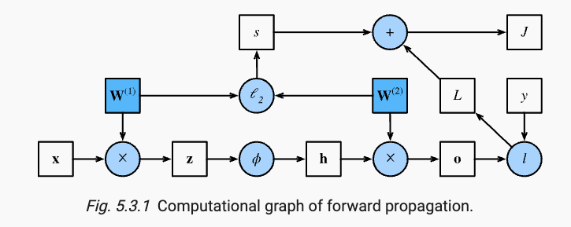
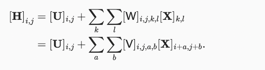
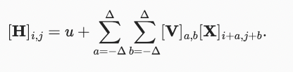
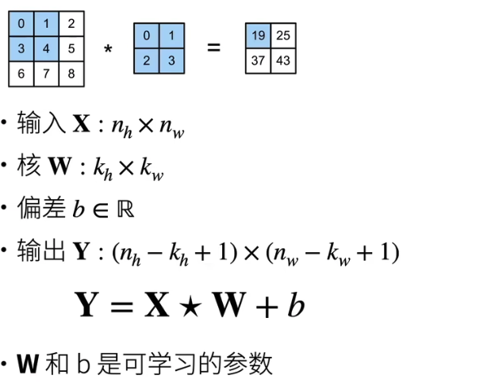

The publishd book is available on [Here](https://d2l.ai/index.html). This is note will only be my summary and personal understanding to some topics in each chapter.

Everytime you start the notebook, you need first run

```python

conda activate d2l
```

and then

```python
jupyter notebook

```

## Introduction

**Machine learning**: A machine learns with respect to a task T, performance metrics P, and type of experience E, if it reliably improves its performance P on task T following experience E.

The example of developing a waking up program for speakers is a typical example for supervised learning, in which inputs and labels are provided. 

Components of ML:

1. Data
2. Model
3. Objective Function

Data: 
The data in ML should have two aspects considered, clean and large size. For clean, the data should well represent the situation we concern, which means we need to make data-cleaning prior to the experiments. On the other hand, the success of modern deep learning models has been largely contributed from big data.

**However** I wonder that whetehr theory in DL regarding small dataset should be developed. For example Bayesian approach might be a possible way, and I have read blog from Standford ML professor saying the importance of small data size DL.

### Kinds of Machine Learning Problems

Supervised Learning: This type of problem has the form: Predict the label given input features.
In Regression problems in SL, it provides continuous outputs and seeks to estimates relationships between inputs and outputs variables.
Regression problems answer the question of how many, such as given the location and size of a houes, how much should the house value

On the other hand, Classification problems in SL recieves class label inputs and gives class output. It tries to understand data pattern
and their cateborical memberhsip.

**Recommender System**: This field provides personalized content to users. Applications include Tik Tok, Movie Recommendation, Product retail. Given the model for any user
we can retrieve objects rated with highest score. One of the problem of current recomender system is censored feedback, in which scores and recommendation are based on the current recommending algorithms. In other words, from my understanding, it's bised. 

**Sequence Learning:** Problems that inputs and ouputs consits variable-length sequence. They require a model to either ingest a sequence or emit sequence of output (or both)

### Unsupervised Learning

Unsupervised Learning doesn't recieve labels or ground truth value from input, but instead the learning algorithms find the hidden pattern within the data. 
One majoy development in UL is *self-supervising learning*, techniques that leverage aspects of data to provide supervision. 

### Interacting with Enviroment


The training is completed in isolation with the enviroment. More precisely, the training data is obtained before the training process and the training process
will learn from the given data to produce a prediction. *However,* we develop the learning algorithm for the sake of helping actual problem, more specifically
to make action to interfere with the enviroment. For example, previously I wrote the example of video recommender system, and the system will make recommendation based
on given data. This recommendations suggested to users are based on previous preference users, and users will likely select something among recommndation, which further suggest future recommendation produced by the algorithm.

It's critical to realize that these recommendation might be biased ignoring other potential recommendation, because the future recommendation is based on previous recommendation.

The latter pursuit opens a wide range of question in modeling

* Does the enviroment remember what it did?
* Does the enviroment want to help us or beat us? What is the position of the enviroment?

### Reinforcement Learning


Reinforcement Learning aims to develop an agent that interacts with dynamic enviroment and takes actions. RL takes action over a series of time step. In each time step, it recieves observations from enviroment and choose an action to responde the enviroment through some mechanism (actuator), and finally the agent recieves reward from enviroment

It's critical to point out the connection between supervised learning and reinforcement learning. SL can be casted into RL. For example, a binary classfication problem in SL can be transformed into RL by choosing one of two actions for each input. *Importantly,* RL doesn't need to know the optimal solution in front, but learn it through feedbacks. RL is suitable for partial observaion in which information is limited. Finally, RL has to balance between local optimality and exploration of strategy space. In some cases, it needs to reject the current known optimal strategy to explore other alternatives in the strategy space.

### Roots of Machine Learning

There are four roots for ML, statistics, information theory, theory of computation and neuroscience. Previously, due to lack of data and computing resources, researchers need to use more efficient models and (generalized) linear model and kernel methods. With recent advent in computing power (GPU) and growing size of data, deep neural network has become popular. *However*, it important to aware that the progress in Deep learning is not simply a result of growing resrouces applied to old algorithms.

### Essence of Deep Learning

Deep learning is a subset of machine learning concerned with many layers of neural networks. What differentiate deep learning is that operations learned from each of the layers are learned jointly from data

> The problems that we have discussed so far, such as learning from the raw audio signal, the raw pixel values of images, or mapping between sentences of arbitrary lengths and their counterparts in foreign languages, are those where deep learning excels and traditional methods falter.

*Question:* Why the traditional methods falter? What is the traditional methods mentioned here?


Deep learning provides an *end-to-end* training. It indicates that deep learning builds the system and tunes its performance jointly rather than builds the system based on integraion of components. Traditionally, scientists separate feature-extraction from model training, but in deep learning feature extractors are replaced by automiatically tuned filters yielding better accuracy.

**Note:** In DL automatically tune performance is a part of system building, whereas in traditionally approaches systems are built  based on individually tuned components.
For example, feature extractions, model trainings, model evaluations and selections are components in a machine learning experiment, but these components are altogether included as an unity in deep leraning framework. 

The abundunt data size allows us to fit the data with nonparametric models that more fit the data, albeit a sacrifice on explanability


## Preliminaries

### Automatic Differentiation

```python
import torch

x = torch.arange(4.0, requires_grad=True)
y = 2 * torch.dot(x,x)

y.backward()
```

## Linear Neural Network for Regression

### Linear Regression

Whenever we want to predict a numerical value, we are dealing with regression problems.

$$y = \hat{y} + \epsilon$$

This is the linear regression model we use to predict true observed data y.

$$\hat{y} = \vec{w}^T \vec{x} + b $$

$$ \hat{y} = Xw + b$$

Here $$\hat{y}$$ is our prediction model, and vectors are column vectors. $$\vec{x}$$ is predictors in our model. This is means that each x is a feature of the problem we believe affect the outcome y, and $$\vec{w}$$ is the weight of all predictors.

Besides the points mentioned in the book, I want to further mention techniques to find which variables are important for predicing the true y value, i.e. Variable Selction.

$$\Omega^2 = \sum_{i=1}^d \rho_i^2$$

where $$\rho_i^2$$ is the correlation between $$x_i$$ and $$y$$

, and $$\Omega^2$$ is squared multiple correlation, which indicate the proportion of the variation explained by the predictors. More specifically, we can rank each $$\rho_i^2$$ to investigate which predictor contribute more for explaining y. 

By doing the ranking, we not only can determine which variables are important for deciding y, but also which variables are not important yielding to reduction.

### Loss Function

To measure the fitness of our model, we want to introduce  *loss function*. The most common loss function is square error (least square)

$$ l^i( \vec{w},b) = \frac{1}{2}(\hat{y}^i - y^i)^2 $$

For the loss of the entire dataset, we sum all individual loss

$$L(\vec{w}, b) = \frac{1}{n}\sum_{i=1}^n l^i(\vec{w},b) = \frac{1}{n}\sum_{i=1}^n \frac{1}{2}(\vec{w}^Tx^i + b -y^i)^2 $$

we want to find the w and b such that the L is minimized.

To find an analytical solution for the loss function, is easy.

$$ \lVert Xw - Y \rVert^2$$ 

by taking derivative respect to w, we found

$$ \partial_w \lVert X\vec{w} - Y \rVert^2 =  2X^T(X\vec{w} - y)=0 $$

so this gives $$\vec{w} = (X^TX)^{-1}X^Ty $$

where the invertibility of $$(X^TX)$$ is required to find the optimal weights.


Core Learning Strategy: iteratively reduce error by updating parameter in the direction that errors are incrementally decreased

**Note**: vectorizaion of value can lead to dramatic speedups


In pytorch, data module provides toos for data procesing, nn module gives a large number of neural network layers and common loss function. We can initialize the parameters by replacing their values with methods ending with _. 

## Linear Model for Classification

Softmax

$$
softmax: \hat{y_i} = \frac{\exp{o_i}}{\sum_{k=0}{\exp(o_k)}}
$$


## Forward Propagation, Backward Propagation, and Computational Graph

To implement the model we use forward propagation, and to calculate gradients we use backpropagation.

### Forward Propagation




### Backward Propagation

The method traverses the neural network from outputs to inputs using chain rule in calculus. 

For the picuture above, the objective is to calculate $$\frac{\partial J}{\partial W_1}$$ and $$\frac{\partial J}{\partial W_2}$$

### Numerical Stability

The problem of vanishing gradients in logistic model causes the gradients might vanish at some points in training, lossing both information and numerical stabiliy.

Alternatively, ReLu with the simple computation and free from vanishing gradient is the default activation function used.

On the other hand, exploding gradients is another problem in training


### Generalization in Deep Learning

Classfying and Predicting are our intermediate steps, in Machine learning we aim to **find the general pattern so that we can make correct prediction, even with unseen example from the same underlying population**. 

Although deep learning has good application in CV, NLP, and recommendor system etc, we don't have an answer for question such as *why it fit the model well* and *why it generalizes to unseen example well*. In other words, we don't have an explanation into the black box of deep learning.

#### Revisiting Regularization and Overfitting

Generalization error: the error rate of testing set of a model.

Generalization gap: the gap between training error and testing error.

When generalization gap is large, our model overfitts the training data, indicating that we need shrink the number of features to capture, or reduce the number of non-zero features. (This is similar to variable selection in statistics. Where we determine the p-value to indicate to remove or not remove the variable)

The relation between generalization gap and model complexity can be non-monotonic.


### Dropout

The aim of machine learning is to predict well on seen examples, extracting under-lying patterns. Classical ML thoeries suggest that simple model will shorten the gap between training and testing performance.

Bishop drew the connection between requirements for smoothness of function and reqiurements  for that functions are resillient to perturbations in inputs. (1995)

**Dropout**: is a techniques that we randomly drop some neurons revealing differnent learning path in the path. This is similar to human brain learning, in which we depend less on some neurons and more on others. To find the optimal path, we try different combinations if neurons in the neural networks.

In Dropout, Bishop added a Gaussian noies to the input $$\epsilon \sim N(0, \sigma^2)$$ from which we have $$x' = x + \epsilon$$, where x' is the perturbated input.

Thus we have expectation $$E[x'] = x$$, since $$E[\epsilon] = 0$$

In standard dropout design, we have dropout some nodes with probability p, and normalize those not droped out nodes according to below function.

$$
h' = 
\begin{cases}
0& \text{with probability p}\\
\frac{h}{1-p}& \text{otherwise}
\end{cases}
$$

## Convolutional Neural Network

1. Convolution: apply filters to generate feature maps.
2. Non-Linearity: Often ReLU
3. Pooling: Downsampling operation on each feature map.

### Discussion on Design of CNN Architecture

The design of CNN Arch should be

1. earliest layers should response similarly to whatever in the image. Translation *invariance*
2. earliest layers should only focus on regions that are near to them rather than distant region. *Locality*
3. deeper layers should be able to capture longer features



The issue here is that to represent the fully connected layers too many nodes need to be memorised.

#### Translation Invariance

X: is the inputs features.
W: is a fourth order index weight matrix
U: is the matrix of biases
V: is a fourth order index weight matrix. The relation between W and V is that $$[W]_{i,j,}$$

This implies a shift in inputs X, should have a shift in hidden layers H. This is possible on when U and V are independent from (i,j), where (i,j) is the position of a pixel. 

This is intuitive, since the bias of a vector of inputs doesn't depend on the order of element in the vector. Similarly, the weights of vectors don't depend on location of the pixel, but rather depends on the information carried by pixiels.

[This portion of the text book mentioned the invariance of location of pixel I discussed above](https://d2l.ai/chapter_convolutional-neural-networks/why-conv.html#:~:text=2.1.%20Translation%20Invariance)

$$
h_{i,j} = \sum_{a,b}v_{i,j,a,b}x_{i+a,j+b}
$$

Here the change in i,j will also change the value of the filter. Regardless which location on the image, the filter should have the same weight. To takcle with this issue, we let the following $$v_{i,j,a,b} = v_{a,b}$$

so we have 
$$h_{i,j} = \sum_{a,b}v_{a,b}x_{i+a,j+b} $$
This is relative cross

### Locality

1. Apply a window of weights
2. Compute linear combiations
3. Activate with non-linear function




$$ 
|a| < \Delta^2 and |b| < \Delta^2
$$ so we have the following equation

$$h_{i,j} = \sum_{a=-\Delta}^{\Delta} \sum_{b=-\Delta}^{\Delta} v_{a,b}x_{i+a,j+b} $$

The equation above is *Convolutional Neural Networks*. They are spatial families of neural networkds which contain convolutional layers

### Convolution

Convolution between two functions $$f,g: \real^d \rightarrow \real$$ is defined as 

$$
(f*g)(x) = \int f(z)g(z-x)dz
$$

This means that we meansure the overlap between two functions when one of the function is fliped by y-axis and shifted by x units.

For discrete variables, we turn the integral into a sum.

$$
(f*g)(i) = \sum_a f(a)g(i-a) 
$$

For two dimensional functions the convolution is written as 

$$
(f*g)(i,j) = \sum_a \sum_ f(a,b)g(i-a,j-b)
$$

In the case of discrete variables, we think the input i and j and the upper bound of value space. The summation starts from a and b, and ends at i and j. If f takes values on (a,b), g will take the remaining area (i-a,j-b)

### CNN for classification: Feature Learning

1. Learn features in input through convolution
2. Introduce non-linearity thourgh activation function
3. Reduce dimensionality and preserve spatial invariance with pooling

Convolutional and pooling layers output high-level features of input. These two parts of layers are responsible to extract features. 

Fully-connected layer uses these features for classifying input image. In this part, the architecture can be changed to other  forms, caping other task in ML. It can change to arch. for regression, object detection, sigmentation, as well as probabilistic control


Finaly, the pipeline will express the probability of image beloning to a particular class.

$$softmax(x) = \frac{e^{y_i}}{\sum_j{e^{y_j}}} $$


### Object Detection With R-CNN

R-CNN: find regions that we think have objects. Use CNN to classify.

1. input image
2. Extract region proposals
3. Compute CNN features

*Qustion*: who tells the region? Human gives the heuristic or the computer finds itself?

### Two dimensional convolutional layer



卷基层就是特殊的全联接层

Two dimensional convolution is the major image application. There are one-dimensional and three-dimensinoal Conv.

* 1D: Text, language, time series
* 2D: Image
* 3D: video, medical image, climate map

1D
$$
y_i= \sum_{a=1}^h w_a x_{i+a}
$$

and 3D

$$
y_{i,j,k} = \sum_{a=1}^h \sum_{b=1}^w \sum_{c=1}^d w_{a,b,c}x_{i+a,j+b,k+c}
$$

Convolution Laye convolves inputs and kernel matrix and adds a shift to get output.

Kernel Matrix and shift can be learned as hyper parameter

Size of kernel matrix is a hyper parameter

### Convoltion for Images

#### Learning a Kernel

We can first initialize a convolution layer with random weights. In each iteration, we will use squared error to compare Y with the output of the convolution layer, and then we will compute gradients to update the kernel.

The approach mentioned above is similar to a learning algorithm. 

Question: If it follows a gradient descent approach, can we ensure that the function is concave. what are the similarities between learning the kernel comparing with learning a weight of a linear model.

#### Feature Map and Receptive Field

Receptive Field of an Element: is defined as all elements from all previous layers which will affect the calculation of x.

Feature Map: the output of a convolutional layer

When any element needs a larger receptive field to detect input feature over a broader area, we can build a deeper neural network.

### Padding and Striding

Padding can help you to expand the input layer to a larger layer by adding  some paddings around the original layer.

Padding has row $$p_w$$ and column $$p_h$$, so the output will be in dimension $$(n_h - k_h + p_h + 1) \times (n_w - k_w + p_w + 1) $$

Usually, $$p = k - 1 $$ for both dimensions.

* when $$k_h$$ is odd, add padding on top and bottom by $$p_h / 2 $$
* when $$k_h$$ is even, add padding on top by $$\lceil p_h/2\rceil$$, and on bottom $$\lfloor p_h/2\rfloor $$


For given striding with height and width $$s_h$$ and $$s_w$$

* in easy case, if the padding and input are even with even stride, the result dimension will be $$(n_h/s_h) \times (n_w/s_w)$$
* in general $$\lfloor(n_h - k_h + p_h + s_h)/s_h\rfloor \times \lfloor(n_w - k_w + p_w + s_w)/s_w\rfloor $$


### Multiple input and Multiple Output Channel

Multiple Input
$$
Y = \sum_{i=0}^{c_i}X_{i,:,:}\times W_{i,:,:}
$$

* input X: $$c_i \times n_h \times n_w$$
* kernel W: $$c_i \times k_h \times k_w$$
* output Y: $$m_h \times m_w$$

Here every channel has a convolution kernel, and the output is the sum of all channels of convolution kernels


#### Multiple Output

Every 3D convolution kernel will generate an output channel

* output X: $$c_i \times n_h \times n_w $$
* kernel W: $$c_o \times c_i \times k_h \times k_w $$
* output Y: $$c_o \times m_h \times m_w $$

The ith channel will perform a cross correlation with  the ith layer in the kernel, and it will produce a single layer in the output.

$$
Y_{i,:,:} = X \times W_{i,:,:,:}~~ for  ~~ i = 1,...,c_o
$$

Note: here we have four dimentions in the weight matrix W

individually, the components of weight are
$$ c_o \times c_i \times k_h \times k_w $$ 

The result on each output channel is calculated from the convolution kernel corresponding to that output channel, and takes input from all channels in the input channels
#### 2D Convolution Layer

* Input X: $$c_i \times n_h \times n_w $$
* Kernel W: $$c_o \times c_i \times k_h \times k_w $$
* Bias B: $$c_o \times c_i$$
* Output Y: $$c_o \times m_h \times m_w $$
* Complexity: $$O(c_ic_ok_hk_wm_hm_w ) $$


### Pooling


