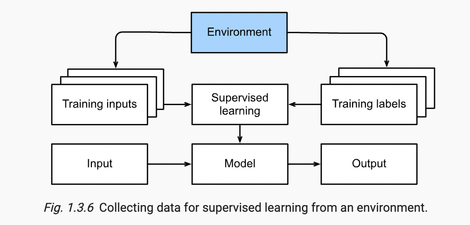
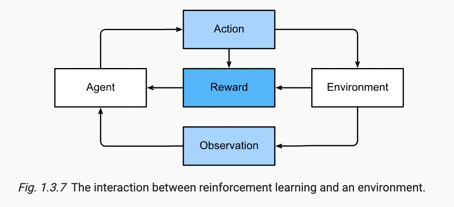

The publishd book is available on [Here](https://d2l.ai/index.html). This is note will only be my summary and personal understanding to some topics in each chapter.

Everytime you start the notebook, you need first run

```python

conda activate d2l
```

and then

```python
jupyter notebook

```

## Introduction

**Machine learning**: A machine learns with respect to a task T, performance metrics P, and type of experience E, if it reliably improves its performance P on task T following experience E.

The example of developing a waking up program for speakers is a typical example for supervised learning, in which inputs and labels are provided. 

Components of ML:

1. Data
2. Model
3. Objective Function

Data: 
The data in ML should have two aspects considered, clean and large size. For clean, the data should well represent the situation we concern, which means we need to make data-cleaning prior to the experiments. On the other hand, the success of modern deep learning models has been largely contributed from big data.

**However** I wonder that whetehr theory in DL regarding small dataset should be developed. For example Bayesian approach might be a possible way, and I have read blog from Standford ML professor saying the importance of small data size DL.

### Kinds of Machine Learning Problems

Supervised Learning: This type of problem has the form: Predict the label given input features.
In Regression problems in SL, it provides continuous outputs and seeks to estimates relationships between inputs and outputs variables.
Regression problems answer the question of how many, such as given the location and size of a houes, how much should the house value

On the other hand, Classification problems in SL recieves class label inputs and gives class output. It tries to understand data pattern
and their cateborical memberhsip.

**Recommender System**: This field provides personalized content to users. Applications include Tik Tok, Movie Recommendation, Product retail. Given the model for any user
we can retrieve objects rated with highest score. One of the problem of current recomender system is censored feedback, in which scores and recommendation are based on the current recommending algorithms. In other words, from my understanding, it's bised. 

**Sequence Learning:** Problems that inputs and ouputs consits variable-length sequence. They require a model to either ingest a sequence or emit sequence of output (or both)

### Unsupervised Learning

Unsupervised Learning doesn't recieve labels or ground truth value from input, but instead the learning algorithms find the hidden pattern within the data. 
One majoy development in UL is *self-supervising learning*, techniques that leverage aspects of data to provide supervision. 

### Interacting with Enviroment




The training is completed in isolation with the enviroment. More precisely, the training data is obtained before the training process and the training process
will learn from the given data to produce a prediction. *However,* we develop the learning algorithm for the sake of helping actual problem, more specifically
to make action to interfere with the enviroment. For example, previously I wrote the example of video recommender system, and the system will make recommendation based
on given data. This recommendations suggested to users are based on previous preference users, and users will likely select something among recommndation, which further suggest future recommendation produced by the algorithm.

It's critical to realize that these recommendation might be biased ignoring other potential recommendation, because the future recommendation is based on previous recommendation.

The latter pursuit opens a wide range of question in modeling

* Does the enviroment remember what it did?
* Does the enviroment want to help us or beat us? What is the position of the enviroment?

### Reinforcement Learning



Reinforcement Learning aims to develop an agent that interacts with dynamic enviroment and takes actions. RL takes action over a series of time step. In each time step, it recieves observations from enviroment and choose an action to responde the enviroment through some mechanism (actuator), and finally the agent recieves reward from enviroment

It's critical to point out the connection between supervised learning and reinforcement learning. SL can be casted into RL. For example, a binary classfication problem in SL can be transformed into RL by choosing one of two actions for each input. *Importantly,* RL doesn't need to know the optimal solution in front, but learn it through feedbacks. RL is suitable for partial observaion in which information is limited. Finally, RL has to balance between local optimality and exploration of strategy space. In some cases, it needs to reject the current known optimal strategy to explore other alternatives in the strategy space.

### Roots of Machine Learning

There are four roots for ML, statistics, information theory, theory of computation and neuroscience. Previously, due to lack of data and computing resources, researchers need to use more efficient models and (generalized) linear model and kernel methods. With recent advent in computing power (GPU) and growing size of data, deep neural network has become popular. *However*, it important to aware that the progress in Deep learning is not simply a result of growing resrouces applied to old algorithms.

### Essence of Deep Learning

Deep learning is a subset of machine learning concerned with many layers of neural networks. What differentiate deep learning is that operations learned from each of the layers are learned jointly from data

> The problems that we have discussed so far, such as learning from the raw audio signal, the raw pixel values of images, or mapping between sentences of arbitrary lengths and their counterparts in foreign languages, are those where deep learning excels and traditional methods falter.

*Question:* Why the traditional methods falter? What is the traditional methods mentioned here?


Deep learning provides an *end-to-end* training. It indicates that deep learning builds the system and tunes its performance jointly rather than builds the system based on integraion of components. Traditionally, scientists separate feature-extraction from model training, but in deep learning feature extractors are replaced by automiatically tuned filters yielding better accuracy.

**Note:** In DL automatically tune performance is a part of system building, whereas in traditionally approaches systems are built  based on individually tuned components.
For example, feature extractions, model trainings, model evaluations and selections are components in a machine learning experiment, but these components are altogether included as an unity in deep leraning framework. 

The abundunt data size allows us to fit the data with nonparametric models that more fit the data, albeit a sacrifice on explanability


## Preliminaries

### Automatic Differentiation

```python
import torch

x = torch.arange(4.0, requires_grad=True)
y = 2 * torch.dot(x,x)

y.backward()
```

## Linear Neural Network for Regression

### Linear Regression

Whenever we want to predict a numerical value, we are dealing with regression problems.

$$y = \hat{y} + \epsilon$$

This is the linear regression model we use to predict true observed data y.

$$\hat{y} = \vec{w}^T \vec{x} + b $$

$$ \hat{y} = Xw + b$$

Here $$\hat{y}$$ is our prediction model, and vectors are column vectors. $$\vec{x}$$ is predictors in our model. This is means that each x is a feature of the problem we believe affect the outcome y, and $$\vec{w}$$ is the weight of all predictors.

Besides the points mentioned in the book, I want to further mention techniques to find which variables are important for predicing the true y value, i.e. Variable Selction.

$$\Omega^2 = \sum_{i=1}^d \rho_i^2$$

where $$\rho_i^2$$ is the correlation between $$x_i$$ and $$y$$

, and $$\Omega^2$$ is squared multiple correlation, which indicate the proportion of the variation explained by the predictors. More specifically, we can rank each $$\rho_i^2$$ to investigate which predictor contribute more for explaining y. 

By doing the ranking, we not only can determine which variables are important for deciding y, but also which variables are not important yielding to reduction.

### Loss Function

To measure the fitness of our model, we want to introduce  *loss function*. The most common loss function is square error (least square)

$$ l^i( \vec{w},b) = \frac{1}{2}(\hat{y}^i - y^i)^2 $$

For the loss of the entire dataset, we sum all individual loss

$$L(\vec{w}, b) = \frac{1}{n}\sum_{i=1}^n l^i(\vec{w},b) = \frac{1}{n}\sum_{i=1}^n \frac{1}{2}(\vec{w}^Tx^i + b -y^i)^2 $$

we want to find the w and b such that the L is minimized.

To find an analytical solution for the loss function, is easy.

$$ \lVert Xw - Y \rVert^2$$ 

by taking derivative respect to w, we found

$$ \partial_w \lVert X\vec{w} - Y \rVert^2 =  2X^T(X\vec{w} - y)=0 $$

so this gives $$\vec{w} = (X^TX)^{-1}X^Ty $$

where the invertibility of $$(X^TX)$$ is required to find the optimal weights.


Core Learning Strategy: iteratively reduce error by updating parameter in the direction that errors are incrementally decreased

**Note**: vectorizaion of value can lead to dramatic speedups


