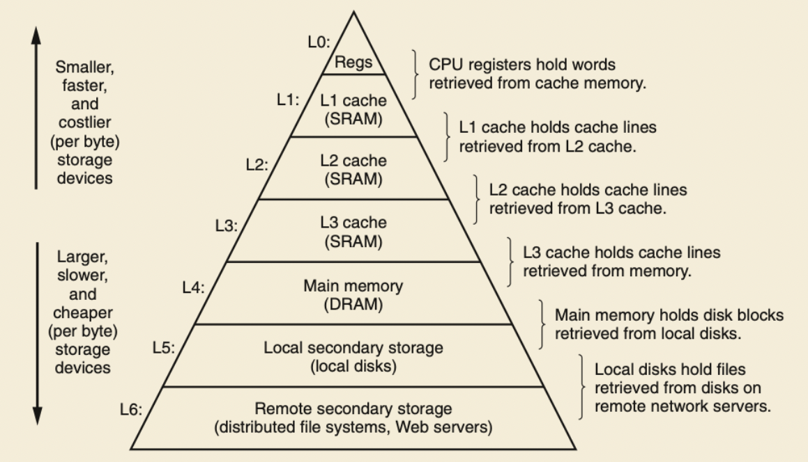

## Storage Technology

We have static random access memory(SRAM) and dynamic random access memory(DRAM). The former is more for cache memory, and the latter is for main memory.

SRAM: it stores each bit in a bistable memory cell, and each cell is implemented with 6-transistors.

Bistable cell means that the will remain stable in either one of the cell voltage configuration -- states. Any other states will be unstable, turning quickl in either stable states. Think about it as a upside down pendulum.

DRAM: it stores each bit as a charge on a capacitor. This cell is very sensitive. Any disturbe will cause the cell lose information. But memory periodically refreshed by reading data out and rewriting it, so any error will be corrected.

Memory Controller: DRAM is connected to some circuitry known as *memory controller*. Memory controller wants to read content in (i,j) in DRAM but sending a request to DRAM, and DRAM will respond by sending the content in supercell (i,j). 

The address is sent in two stages. First send i row, and second send j column. This increases the access time, but reduces the number of parameters to represent an address.

Bus: A bus is a collection of parallel wires that carry addres, data, and control signals. It's typically shared by multiple devices.

We need to notice the bus that carries data and address between components.

The main components are

* CPU
* I/O bridge (includes memory controller)
* DRAM modules that make up *main memory*

These are connected by two pair of buses

* System bus: it connects I/O bridges and CPU
* Memory bus: it connects I/O bridges and main memory

### Disk Storage

The disk is a cynlinder. The capacity of a disk is determined by three factors

1. Recording density: The amount of bits can be stored into 1 inch segement of track
2. Track Density: number of tracks can be squeezed into one inch of radia segment
3. Areal Density: product of recording and track density.

computing disk capacity

$Capacity = (\# bytes/sector)*(avg.\#sector/track)*(\# tracks/surface)*(\#surfaces/platter)*(\#platters/disk)$

Disk Operation(single-platter view)

Look at the operation image. Any read and write operation is done by moving the arm radially over any track.

### I/O Bus

## Locality

Locality bridges CPU-Memory gap.

Locality:

* Principle of Locality: Programs tend to access data that is near or equal the location of recent instructions.
* Temporal Locality: Recently referenced data is more likely to be referenced again in near future.
* Spatial Locality: data with nearby address tend to be referenced close together in time. (相邻数据在短时间内更可能同时调用)(that is data with near address tends to be referenced in a short interval)

## Memory Hierarchies

Facts:

* Fast storage technologies **cost more per byte**, have **less capacity** and require more power(heat!)
* Gap between CPU and main memory speed is widenning
* Well-written programs tend to exploit locality

**Caches**: A smaller, fasetr storage devie that acts as a staging area for a subset of the data in a larger, slower device.

**Important:** For each k, the faster, smaller device at level k serves as a cache for the larger, slower device at level k+1.

cache hit: to access object d from level k+1, first read level k in which the proram is on. If d is found from level k, this is called cache hit.

cache miss: in the above example, if d is not found in level k, it is called cache miss

The reason why memory hierachies work is that because locality program tend to access data at level k more often than data at level k+1, so storage at level k+1 can be slower.

**Big idea**: The memory hierachy create a large pool of storage that costs as cheap as storage near the bottom, but serves data to programs at the rate of fast storage near the top. This means that eventually we want the storage  cost as low as bottom storage and as fast as top storage. **Cheap and Fast**

General Caching Concepts:

1. Cold(compulsory) miss: it occurs because the cache starts empty and this is the first reference to the block
2. Capacity miss: it occurs when the set of active cache blocks is larger than the cache
3. Conflict miss: it occurs when the level  cache is larg enough, but multiple data objects all map to the same level k block.
