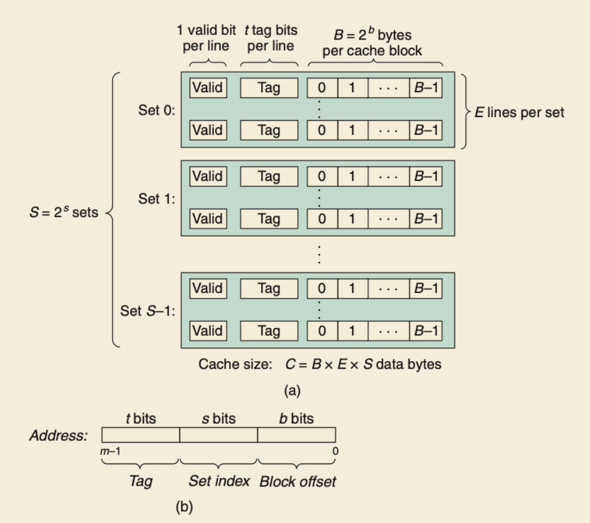
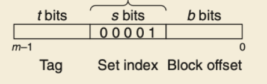
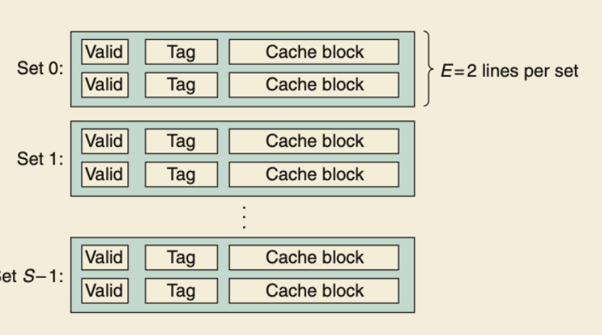
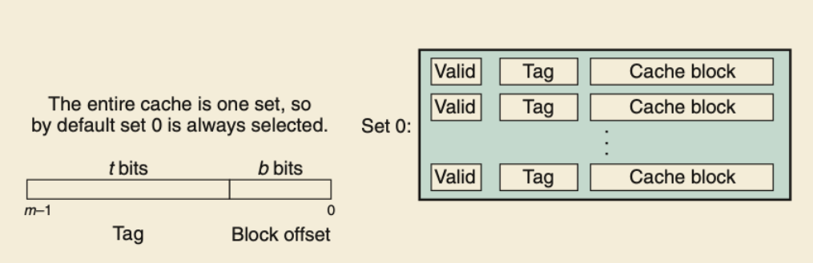

The main topics are about cache operation, qualitative of cache performance and quantitative of cache performance.

I need to understand the first part how the    data is read from cache and write to cache, and secondly how the miss rate and those quantitative approaches are estabilished. Most importantly, code styles that exploit 

## Cache Organisaiton

tuple: (S,E,B,m) characterizes the a cache's organisation.

* S is the number of sets in the cache
* E is the number of lines in a set
* B is the number of blocks in a line
* m is the number of physical(main memory) address bits


the capacity of a cache $$C = S * E * B$$

A line in the set containsthe word if and only if the valid bit is set and the tag bits in the line match the tag bits in the address.




Three steps to determine if a word is miss or hit and then extracting the word:

1. set selection
2. line matching
3. word extraction


Below is a bits representation for addresses in caches.



The number of blocks determine the bits for block in the binary form. The number of sets determines the bits for set in the binar form, and the remaining bits are form tags.


### Direct-Mapped Caches

direct-mapped cache: is a cache with exactly one line per set(E=1).

cache organization: (4,1,2,4)

When we read address 8  from the cache. First CPU do a modulo operation. $$8\pmod{4} \equiv 0$$

0 means the set 0.

If the read is miss, CPU needs to read from memory, then by another mod operaion. 

$$8/2 = 4 $$

The CPU read block 4, and replace the content in set 0. Note: we can do this because this is a direct-mapped cache.

Everytime the read instruction will read the whole line from the memory and writes into the cache.

Moreover, the if the operation $$8\pmod{2}\equiv 0$$ CPU get the data from block[0], and $$8\pmod{2}\equiv 1$$ CPU gets the data from block[1], given the cache organization above.


### Conflict Miss

If we have plenty of rooms in the cache, but keep alternating references to blocks that map to the same set. This is conflict miss.


```C
float dotprod(float x[8], float y[8])
{
    float sum = 0.0;
    int i;

    for (i=0; i<8; i++)
    {
        sum += x[i] * y[i];
    }
    return sum;
}
```

This function has good spatial locality, but from the cache view, it is waste of storage resources. Everytime the CPU reads x[0]-x[3] into the cache, and secondly the CPU miss y[0], then reads y[0]-y[3]. Later, CPU wants x[1], but the content was rewritten by the previous y[0] fetching.

To tackle with this problem, we put B byte of *padding* at the end of each array, changing the array declaration from x[8] to x[12]

### Set Associative Caches

The thrashing problem in direct-mapped cache is caused by the fact there is only one line in each set.

**Set Associative Caches**: a cache with 1<E<C/B is called an E way set associative cache.





Set selection is identical to the direct-mapped cache.

Line matcing is more complex than direct-mapped cache. Conventional cache is a array values, which recives an address and output the value. An *associative memory* is like an associative array (key-value) pairs. It takes a key and returns one of the value that match the (key-value). This means that there will be more than one paris satisfying a given key.

Consider a set of associative cache as a small associative memory where the keys are concatenation of the tag and valid bits, and the values are the contents of a block. *Note*: it's important to realize that any line in the set can contain any memory blocks that map to the set, so the cache must scan each line in the set to find the valid set.


### Fully Associative Caches

A fully associative cache is a cache consists of one single set that contains all cache lines.




