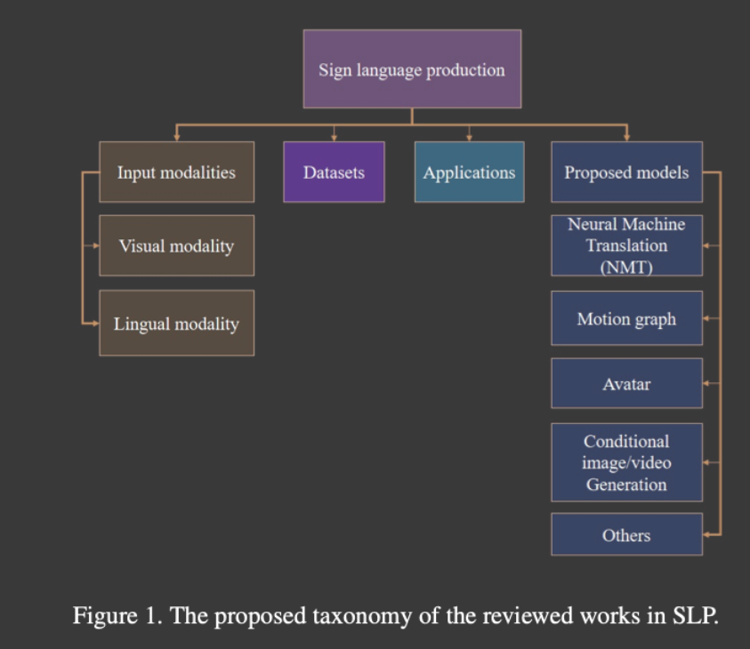

Rastgoo R. etal, Sign Language Production: A Review, 2021.

SLP has the following challenges:

1. visual variability of sign caused by hand-shape, pal orientation, movemen, location, and facial expression
2. gramatical difference between spoken language and sign language is another challenge, since there is no one-to-one mapping.

Visual modality and language modality are two major input modalities on SLP

A RGB video can correspond to one sign word or a concatenated video can be viewed as a sign sentence. GAN and LSTM (long short term memory) are the two most commonl used deep learning techniques.

Lingual modality: text is the most common input.

NMT (Neural Machine Translation) is the most used model.

Challenges in Lingual aspects:

1. domain adoption due to different words style and meaning in different domains.
2. available data size
3. poor performance to unseen words: if a word has not been seen by the model, it won't know what to trnaslate
4. word alignment: this is particularly important if we translating back from target language to source language. This is asking the order
we put each words in target language, making the resulted sentene understandable.

## Application

There are three types of machine translation models:

1. gramatically ruled model
2. statistical model
3. example based model: deep learning is this type of model.

